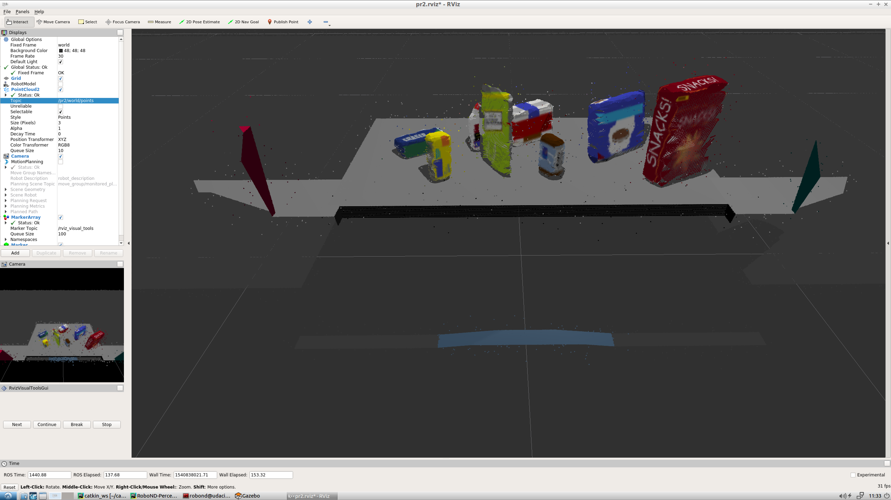
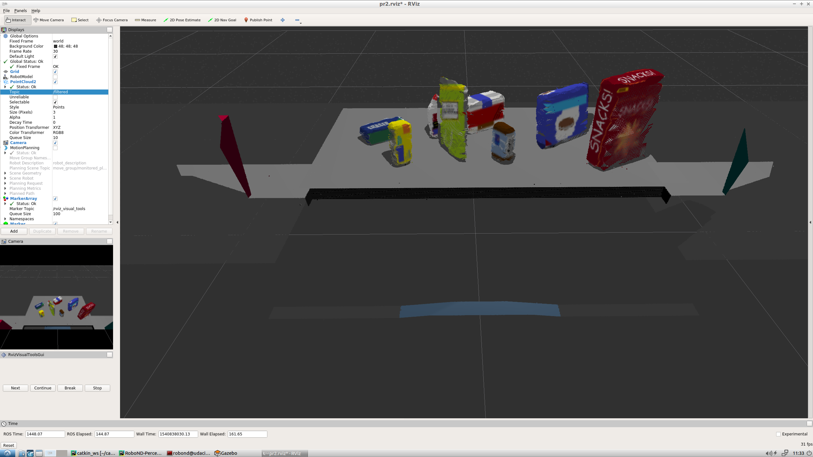
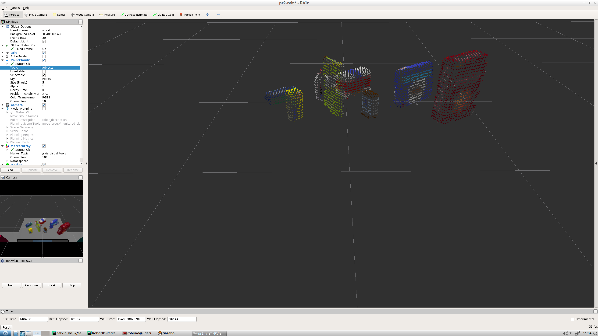
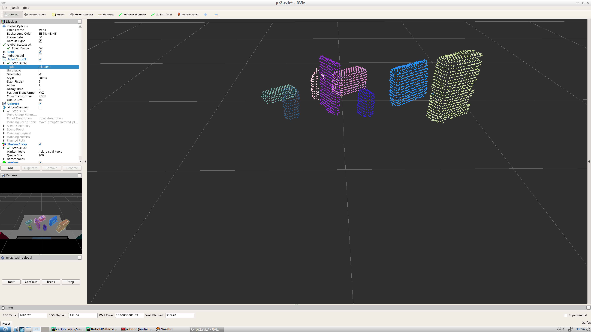
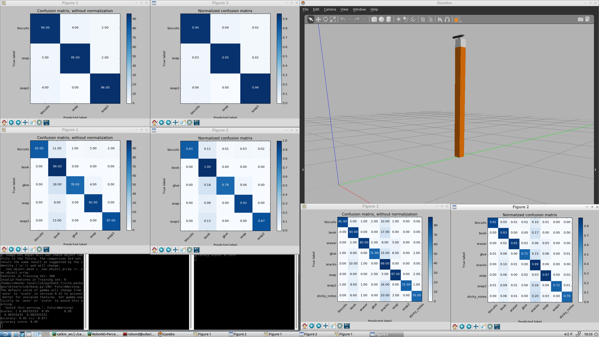
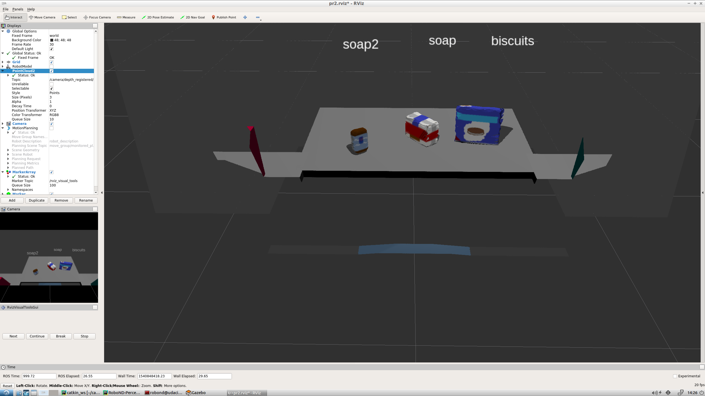
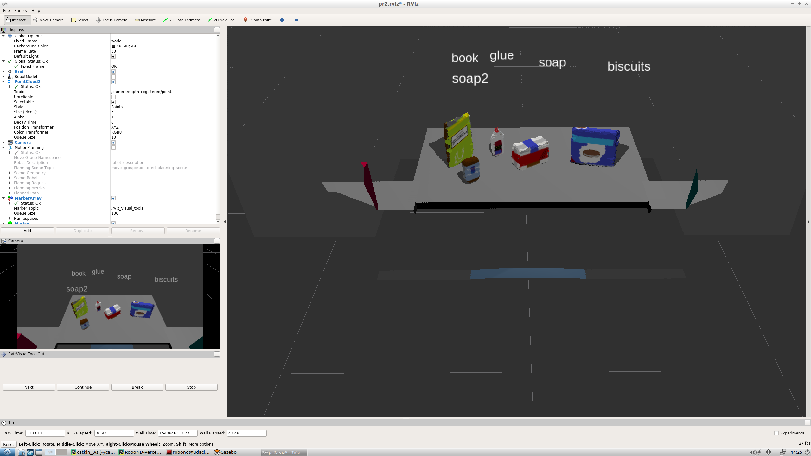
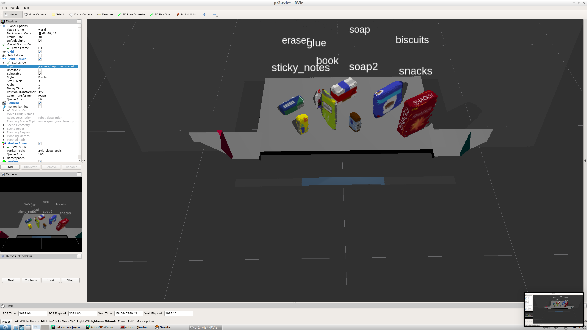

## Project: Perception Pick & Place

### Exercise 1, 2 and 3 pipeline implemented
#### 1. Complete Exercise 1 steps. Pipeline for filtering and RANSAC plane fitting implemented.
In this project, I implemented a 3D perception pipeline that uses ROS pointcloud data to perform object recognition (pr2_robot/scripts/project_template.py).
For the first part of the project, I performed filtering and segmentation on the pointcloud in order to accurately
isolate the objects from the rest of the pointcloud. After converting the ROS pointcloud into PCL format, I first performed
statistical outlier filtering, which removed irrelevant noise. This can be seen by comparing the original and filtered
pointclouds:

Next I performed voxel grid downsampling to reduce the total number of points in the the pointcloud, improving computational efficiency for the later
clustering and detection steps. Next I performed passthrough filtering to isolate the table from the rest of the 
image. I filtered first on the z axis to remove the table leg, and then on the y axis to remove parts of the dropboxes
that were present in the image. Finally, I used RANSAC segmentation to separate the table from the objects.
After downsampling and segmentation, the pointcloud only contained the objects of interest:

#### 2. Complete Exercise 2 steps: Pipeline including clustering for segmentation implemented.  
In the second part of the project, I used clustering techniques to isolate individual objects from each other. This was
accomplished by using PCL's Euclidean clustering functionality with a k-d tree in order to extract clusters of points close together
in 3D space. Afterwards, each cluster was assigned an arbitrary color and the pointcloud appeared as:

#### 3. Complete Exercise 3 Steps.  Features extracted and SVM trained.  Object recognition implemented.
In the third part of the perception pipeline, I performed object recognition on the isolated object clusters using known
objects. To do this, I first extracted color and normal histrogram features from 100 random orientations of each known object
(pr2_robot/scripts/capture_features.py and pr2_robot/scripts/features.py).
I then used these features to train an SVM classifier using sklearn's SCV with an rbf kernel (pr2_robot/scripts/train_svm.py). Finally, I used
the resultant model.sav files to perform real time classification of the clustered objects from the pointcloud, 
ultimately labeling each cluster. The confusion matrix for each world's can be seen here:

### Pick and Place Setup

#### 1. For all three tabletop setups (`test*.world`), perform object recognition, then read in respective pick list (`pick_list_*.yaml`). Next construct the messages that would comprise a valid `PickPlace` request output them to `.yaml` format.

In the final part of the project, I situated my filtering, clustering, and recognition code within a ROS node in order to
perform real time 3D object recognition. I created a `perception` ROS node that subscribed to the pointcloud topic of 
the PR2 RGBD camera. Within the subscriber callback, `pcl_callback`, I added all the abovementioned code, which 
ultimately generated a list of recognized objects with labels and corresponding pointclouds. I passed this list into a 
separate function, `pr2_mover()`, which first parsed the list of known objects for the given world, and then compared 
each object in that pick list to the recognized objects. Once a match was found, the centroid of the object was computed 
and bundled with other metadata including the label and dropbox place position. Finally, all this data was written out to 
yaml files (output_{1|2|3}.yaml).

Overall, the perception pipeline implemented in this project worked quite well. I was able to achieve 100% recognition
on all three worlds:

 
I believe this robustness is due to two main factors. 1) Performing multiple transformations on the
pointcloud, including outlier and passthrough filtering, segmentation, and clustering, allowed the recognition 
classifier to work with only very relevant data. 2) Training the recognition classifier on many different random
orientation of each object helped it perform classification with a high degree of accuracy. However, this was also a 
very well defined perception problem, if it were less well defined (more overlapping objects, moving objects,
unknown objects, objects not easily perceived by an RGBD camera, etc.), this perception pipeline would have certainly
performed more poorly. In the future, I suspect that using a more sophisticated classifier would be the best way to 
improve the system.
